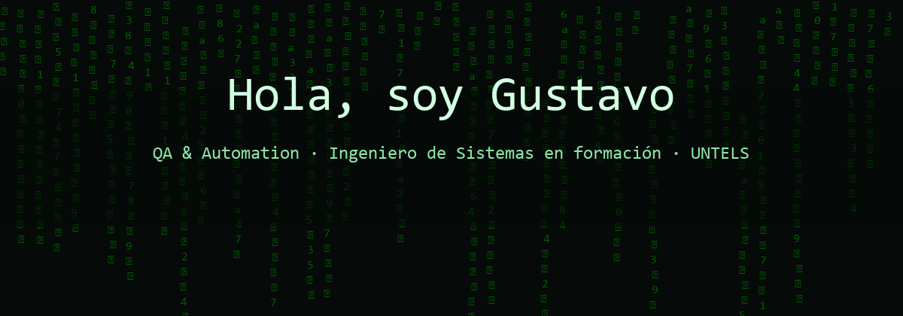

    

# 👋 Gustavo Umeres

**Ingeniero de Sistemas en formación · UNTELS**

QA / Automation — con nociones de desarrollo full stack

---

## Sobre mí

Me apasiona la tecnología. Estudio Ingeniería de Sistemas en la UNTELS y, desde el inicio, mi interés se centró en la calidad del software.

En un mundo donde la inteligencia artificial impulsa la creación de grandes volúmenes de software, la calidad es más importante que nunca. Que una aplicación funcione a primera vista no garantiza que esté perfecta: siempre puede haber errores que el programador no detectó. Por eso mi foco está en el testing: probar, dudar, evidenciar y aportar mejora.

Tengo nociones de programación (Java, Spring Boot, React, SQL) que me ayudan a entender mejor lo que pruebo, pero mi orientación profesional está enfocada principalmente en el QA y la automatización de pruebas.

Sigo la metodología ISTQB, trabajo con los procesos STLC y SDLC, y me desenvuelvo en equipos Agile y Scrum.

---

## Stack

### Testing y automatización

| Tecnología | Uso |
|-----------|-----|
|  | Automatización E2E de UI |
|  | Pruebas E2E y de navegador |
|  | Testing de API |
|  | Diseño de casos de prueba |

### Nociones de desarrollo

    
    
    
    
    

### Herramientas

    
    
    
    
    
    
    

---

## Contacto

Abierto a oportunidades en QA, automatización y equipos ágiles.

    
    &nbsp;&nbsp;
    
    &nbsp;&nbsp;
    
    &nbsp;&nbsp;
    

